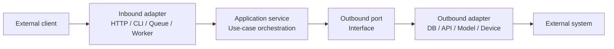
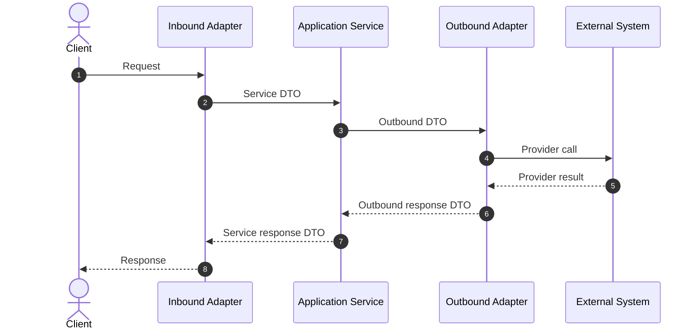

# General Project Structure Reference

This document generalizes the structure of this repository into a reusable reference for creating derived projects. It is intended for developers or AI agents that need to generate a new service with a similar clean, modular architecture.

The original project is a small FastAPI Text-to-Speech microservice, but the structure below can be reused for other services such as speech-to-text, document processing, API gateways, local automation workers, model-serving APIs, or integration microservices.

## Recommended Architectural Pattern

Use a ports-and-adapters architecture, also known as hexagonal architecture.

The core idea:

- Keep business/application logic independent from frameworks.
- Put HTTP, CLI, databases, queues, file systems, AI providers, and third-party APIs behind adapters.
- Define interfaces, called ports, between the application core and external systems.
- Build concrete dependencies in one composition root.



## General Repository Layout

Use this layout as a starting point:

```text
project_name/
  .env
  .env.example
  README.md
  requirements.windows.txt
  requirements.linux.txt
  main.py
  application/
    dtos/
      inbound_dtos.py
      outbound_dtos.py
      service_dtos.py
      mapper/
    ports/
      inbound_port.py
      outbound_port.py
      service_port.py
    services/
      service.py
  composition_root/
    containers/
      container.py
    dependencies/
      dependency.py
    setup/
      setup.py
  infrastructure/
    inbound/
      http/
        fastapi_adapter.py
    outbound/
      provider_name/
        provider_adapter.py
  tests/
    unit/
    integration/
```

For small projects, this may look like more structure than necessary, but it pays off when:

- The service grows.
- You need to swap providers.
- You need to create derived projects.
- You want AI agents to understand boundaries quickly.
- You want business logic to remain testable without live infrastructure.

## Layer Responsibilities

| Layer | Typical Folder | Responsibility | Should Know About | Should Avoid |
| --- | --- | --- | --- | --- |
| Entry point | `main.py` | Start the process. | Setup function. | Business logic, framework details. |
| Composition root | `composition_root/` | Wire concrete implementations. | All concrete classes. | Request handling logic. |
| Application | `application/` | Use cases, DTOs, ports, orchestration. | Abstract ports and DTOs. | FastAPI, database drivers, SDKs. |
| Inbound infrastructure | `infrastructure/inbound/` | Receive external input. | Frameworks and application ports. | Direct provider/database logic. |
| Outbound infrastructure | `infrastructure/outbound/` | Talk to external systems. | SDKs, databases, APIs, devices. | HTTP route handling. |
| Tests | `tests/` | Validate behavior. | Public interfaces. | Hidden coupling to implementation details when possible. |

## Entry Point Pattern

Keep `main.py` minimal.

Recommended shape:

```python
import asyncio

from composition_root.setup.setup import setup

if __name__ == "__main__":
    try:
        asyncio.run(setup())
    except KeyboardInterrupt:
        print("Keyboard interrupt received. Exiting.")
```

Why:

- The process start is easy to understand.
- Startup behavior lives in one setup module.
- Tests and alternate runtimes can import setup components without executing the process.

## Composition Root Pattern

The composition root is where concrete implementations are selected.

Recommended layout:

```text
composition_root/
  containers/
    container.py
  dependencies/
    dependency.py
  setup/
    setup.py
```

### `setup.py`

Responsibilities:

- Load environment variables.
- Read host, port, mode, and provider configuration.
- Build the dependency container.
- Start the server or worker runtime.
- Register shutdown cleanup.

Example responsibilities:

```text
setup()
  -> load .env
  -> read SERVICE_HOST / SERVICE_PORT
  -> BuildContainer()
  -> retrieve app or worker
  -> start runtime
  -> cleanup on shutdown
```

### `container.py`

Defines the top-level dependency container.

Recommended shape:

```python
from dataclasses import dataclass

@dataclass(slots=True, frozen=True)
class Container:
    name: str
    feature_dependency: object

def BuildContainer(name: str) -> Container:
    feature_dependency = generate_feature_dependency()
    return Container(name=name, feature_dependency=feature_dependency)
```

### `dependency.py`

Builds one feature dependency graph.

Example:

```text
generate_feature_dependency()
  -> read feature-specific config
  -> create outbound adapter
  -> create application service
  -> create inbound adapter
  -> return dependency object
```

This is the right place to decide:

- Which provider adapter to use.
- Which database implementation to use.
- Which HTTP app or worker runtime to expose.
- Which environment variables configure each adapter.

## Application Layer Pattern

The `application/` folder should contain code that represents the service's use cases without depending on concrete infrastructure.

Recommended layout:

```text
application/
  dtos/
  ports/
  services/
```

## Ports Pattern

Ports are abstract interfaces.

Use them to define what the application can do without specifying how it is done.

Recommended files:

```text
application/ports/
  inbound_port.py
  outbound_port.py
  service_port.py
```

Typical port methods:

```python
from abc import ABC, abstractmethod

class ServicePort(ABC):
    @abstractmethod
    async def process(self, request):
        pass

    @abstractmethod
    async def is_available(self, request):
        pass
```

Guidelines:

- Keep ports focused on use cases.
- Avoid leaking framework classes into ports.
- Do not use `Request`, `Response`, database sessions, SDK clients, or provider-specific objects in application ports.
- Prefer DTOs or domain objects.

## DTO Pattern

DTOs define data crossing architectural boundaries.

A strict version duplicates DTOs per boundary:

```text
application/dtos/
  inbound_dtos.py
  service_dtos.py
  outbound_dtos.py
```

This is useful when:

- You want strong separation between layers.
- Inbound and outbound shapes may diverge.
- Derived projects may replace adapters.
- You want explicit mapping and easy AI-readable contracts.

For smaller projects, one shared DTO file can be enough. Use separate DTO files when the project is likely to grow.

Recommended DTO style:

```python
from dataclasses import dataclass

@dataclass(slots=True, frozen=True)
class ProcessRequestDto:
    text: str
    options: dict | None = None

@dataclass(slots=True, frozen=True)
class ProcessResponseDto:
    result: bytes
```

Guidelines:

- Use immutable DTOs when possible.
- Keep DTOs free of framework types.
- Include defaults only when they are real runtime defaults.
- Avoid hiding validation in too many places.

## Mapper Pattern

Use mapper modules when DTOs are separated by layer.

Recommended layout:

```text
application/dtos/mapper/
  inbound_to_service.py
  service_to_inbound.py
  service_to_outbound.py
  outbound_to_service.py
```

General request flow:

```text
Inbound DTO
  -> Service DTO
  -> Outbound DTO
  -> Service DTO
  -> Inbound DTO
```

Mapper functions should usually be boring and explicit:

```python
def map_inbound_to_service_request(request):
    return ServiceRequestDto(
        text=request.text,
        options=request.options,
    )
```

Guidelines:

- Keep mappers deterministic.
- Avoid side effects.
- Avoid external calls.
- Use mappers to make boundary changes obvious.

## Service Pattern

The application service orchestrates the use case.

Recommended layout:

```text
application/services/
  service.py
```

Typical service responsibilities:

- Coordinate use-case steps.
- Enforce application-level rules.
- Call outbound ports.
- Map DTOs between service and outbound layers.
- Remain independent from FastAPI, databases, provider SDKs, and OS-specific code.

Example shape:

```python
class FeatureService(ServicePort):
    def __init__(self, outbound_port):
        self.outbound_port = outbound_port

    async def process(self, request):
        outbound_request = map_service_to_outbound_request(request)
        outbound_response = await self.outbound_port.process(outbound_request)
        return map_outbound_to_service_response(outbound_response)
```

Put business rules here when they must be shared across inbound adapters.

Examples:

- Normalize text.
- Validate cross-field constraints.
- Select processing mode.
- Decide retry behavior.
- Coordinate multiple outbound dependencies.

## Inbound Adapter Pattern

Inbound adapters receive input from outside the application.

Common inbound adapters:

- HTTP API
- CLI command
- Message queue consumer
- WebSocket server
- File watcher
- Scheduled job
- Webhook receiver

Recommended layout:

```text
infrastructure/inbound/
  http/
    fastapi_adapter.py
  cli/
    cli_adapter.py
```

For FastAPI, the adapter should:

- Register routes.
- Parse path, query, header, and body data.
- Convert requests into inbound DTOs.
- Call the service port.
- Convert service responses into HTTP responses.
- Handle HTTP-specific errors.

Example flow:

```text
HTTP request
  -> FastAPI handler
  -> inbound DTO
  -> service call
  -> response DTO
  -> JSONResponse / StreamingResponse / FileResponse
```

Guidelines:

- Keep route handlers thin.
- Do not put provider SDK calls in route handlers.
- Do not put database queries directly in route handlers unless the project intentionally avoids layering.
- Treat request/response formatting as infrastructure, not core logic.

## Outbound Adapter Pattern

Outbound adapters talk to external dependencies.

Common outbound adapters:

- Database repositories
- Cloud APIs
- AI model providers
- Local ML models
- File storage
- Device interfaces
- Email/SMS providers
- Search indexes
- Message brokers

Recommended layout:

```text
infrastructure/outbound/
  provider_name/
    provider_adapter.py
```

Outbound adapter responsibilities:

- Translate outbound DTOs into provider calls.
- Handle provider SDK details.
- Convert provider results into outbound DTOs.
- Encapsulate provider-specific retries and errors.
- Hide credentials and connection details from the application layer.

Example shape:

```python
class ProviderAdapter(AdapterOutboundPort):
    def __init__(self, config):
        self.config = config

    async def process(self, request):
        raw_result = await self._call_provider(request)
        return ProcessResponseDto(result=raw_result)
```

Guidelines:

- Keep provider-specific objects inside the adapter.
- Do not expose SDK response types to the application service.
- Centralize retry, timeout, and failure translation here.
- Make it easy to swap this adapter with another provider.

## Configuration Pattern

Use environment variables for runtime configuration.

Recommended files:

```text
.env
.env.example
```

Recommended variable groups:

```text
APP_ENV=debug
SERVICE_HOST=127.0.0.1
SERVICE_PORT=8000

PROVIDER_NAME=local
PROVIDER_TIMEOUT_SECONDS=30
PROVIDER_API_KEY=
```

Recommended config documentation table:

| Variable | Required | Default | Purpose | Example |
| --- | --- | --- | --- | --- |
| `APP_ENV` | No | `debug` | Runtime mode. | `production` |
| `SERVICE_HOST` | No | `127.0.0.1` | Server bind host. | `0.0.0.0` |
| `SERVICE_PORT` | No | `8000` | Server bind port. | `8002` |
| `PROVIDER_API_KEY` | Depends | None | Provider authentication secret. | `sk-...` |

Guidelines:

- Keep secrets out of source control.
- Commit `.env.example`, not production `.env` files.
- Validate required values at startup.
- Fail fast on invalid config.
- Document defaults in README.

## Runtime Flow Template

Every generated project should document its runtime flow.

Recommended structure:

```text
Startup:
  main.py
    -> setup()
    -> load env
    -> build container
    -> construct adapters/services
    -> start server or worker

Request:
  inbound interface
    -> adapter
    -> DTO
    -> service
    -> outbound port
    -> outbound adapter
    -> external dependency
    -> response mapping
    -> client response

Shutdown:
  runtime receives stop signal
    -> stop accepting work
    -> cancel background tasks
    -> close clients/connections
    -> flush state if needed
```

Mermaid template:



## Interface Documentation Template

For every generated project, document all inbound interfaces.

Minimum table:

| Type | Port | Protocol | Path/Topic | Purpose | Handler | Dependencies |
| --- | ---: | --- | --- | --- | --- | --- |
| HTTP | `8000` | HTTP | `POST /process` | Execute primary use case. | `handle_process()` | `FeatureService`, `ProviderAdapter` |

For each inbound interface, document:

- Port number
- Protocol
- Endpoint/path/topic/command
- Purpose
- Authentication requirements
- Expected request format
- Expected response format
- Example request
- Example response
- Internal handler
- Dependencies triggered
- Side effects
- Required environment variables
- Failure behavior
- Timeout/retry behavior

Also document absent interface types when useful:

- No WebSocket endpoints.
- No GraphQL operations.
- No message queues.
- No cron jobs.
- No file watchers.
- No database listeners.

This prevents future developers from guessing.

## State and Persistence Pattern

Every generated project should explicitly classify state.

Use this checklist:

| State Type | Exists? | Where | Notes |
| --- | --- | --- | --- |
| Database | Yes/No | `...` | Tables/collections. |
| File storage | Yes/No | `...` | Temp files, uploads, generated artifacts. |
| Cache | Yes/No | `...` | Redis, memory cache, provider cache. |
| Queue | Yes/No | `...` | Internal or external queue. |
| Sessions | Yes/No | `...` | Auth/session state. |
| Background tasks | Yes/No | `...` | Task lifecycle and shutdown. |
| Process-local state | Yes/No | `...` | In-memory state lost on restart. |

Guidelines:

- Mark process-local state clearly.
- Avoid hidden global state unless intentional.
- Make multi-client behavior explicit.
- Define cleanup behavior for temporary files and tasks.

## Testing Pattern

Recommended test layout:

```text
tests/
  unit/
    test_service.py
    test_mappers.py
  integration/
    test_http_api.py
    test_provider_adapter.py
```

Test layers:

| Test Type | What to Test | Dependencies |
| --- | --- | --- |
| Unit | DTO mappers, service orchestration, validation rules. | No live external dependencies. |
| Adapter | Provider adapter behavior with mocks/fakes. | Mocked provider or test container. |
| Integration | HTTP endpoints, queue consumers, full request lifecycle. | Running app and test dependencies. |
| Smoke | Startup, health, availability. | Minimal live dependencies. |

Guidelines:

- Do not rely only on manual scripts.
- Add integration scripts when useful, but keep automated tests runnable in CI.
- Test failure modes, not only happy paths.
- Test DTO mapping if boundaries are intentionally strict.

## Documentation Pattern

Recommended docs for derived projects:

```text
README.md
PROJECT_STRUCTURE.md
API.md
CONFIGURATION.md
DEPLOYMENT.md
```

For small projects, these can be sections in `README.md`.

At minimum, document:

- What the project does.
- Architecture.
- Runtime flow.
- Ports and interfaces.
- Environment variables.
- Build and run instructions.
- State and persistence.
- Failure modes.
- Security model.
- Extension points.

## Derived Project Generation Checklist

When generating a new project from this structure:

1. Choose the primary use case.
2. Name the application service after the use case.
3. Define service DTOs first.
4. Define outbound ports for each external dependency.
5. Implement the application service against ports only.
6. Add inbound adapters for the required interfaces.
7. Add outbound adapters for concrete providers.
8. Wire everything in the composition root.
9. Add `.env.example`.
10. Document all inbound and outbound interfaces.
11. Add tests for mappers, service behavior, and at least one full request lifecycle.
12. Add explicit shutdown behavior for background work.

## What to Reuse From This Project

Reusable patterns from the original codebase:

- Minimal `main.py`.
- `composition_root/` as the only place that wires concrete dependencies.
- Explicit ports under `application/ports/`.
- Application service that delegates through an outbound port.
- Separate inbound and outbound adapters.
- DTO mappers between architectural layers.
- FastAPI adapter that registers routes and returns framework responses.
- Outbound adapter that hides provider-specific implementation details.

Patterns to improve in derived projects:

- Add `.env.example`.
- Avoid committing virtual environments.
- Add real automated tests.
- Add request validation with Pydantic models where appropriate.
- Add explicit timeouts and retries.
- Add structured logging instead of `print`.
- Add authentication if the service performs expensive or sensitive work.
- Make background task shutdown explicit.
- Document all external system requirements.

## Naming Conventions

Suggested names:

| Concept | Example |
| --- | --- |
| Service class | `TTSService`, `TranscriptionService`, `DocumentProcessingService` |
| Inbound adapter | `FastApiAdapter`, `CliAdapter`, `QueueConsumerAdapter` |
| Outbound adapter | `OpenAIAdapter`, `PostgresAdapter`, `LocalModelAdapter` |
| Service port | `ServicePort` or `{Feature}ServicePort` |
| Outbound port | `AdapterOutboundPort` or `{Provider}Port` |
| Dependency graph | `{Feature}Dependency` |
| Container builder | `BuildContainer()` |

Prefer boring, explicit names over clever abstractions.

## When to Simplify

For a very small project, this full structure may be reduced.

Acceptable simplified layout:

```text
project_name/
  main.py
  config.py
  api.py
  service.py
  provider.py
  tests/
```

Use the full structure when:

- More than one inbound interface exists.
- More than one outbound dependency exists.
- Provider swapping is likely.
- The project will be used as a base for derived projects.
- AI agents or future developers need clean boundaries.

## Reference Mapping From This Repository

The original TTS microservice maps to the general pattern as follows:

| General Concept | Current Repository Example |
| --- | --- |
| Entry point | `main.py` |
| Runtime setup | `composition_root/setup/setup.py` |
| Container | `composition_root/containers/container.py` |
| Dependency graph | `composition_root/dependencies/tts_dependency.py` |
| Inbound adapter | `infrastructure/inbound/http/fastapi_adapter.py` |
| Application service | `application/services/service.py` |
| Service port | `application/ports/service_port.py` |
| Inbound port | `application/ports/adapter_inbound_port.py` |
| Outbound port | `application/ports/adapter_outbound_port.py` |
| Outbound adapter | `infrastructure/outbound/tts/pyttsx3_adapter.py` |
| DTOs | `application/dtos/` |
| DTO mappers | `application/dtos/mapper/` |
| Manual integration tests | `tests/simple.py`, `tests/test_decoupled_stream.py` |

## Core Principle

When generating a derived project, preserve this separation:

```text
Interface handling belongs in inbound adapters.
Use-case orchestration belongs in application services.
External system details belong in outbound adapters.
Concrete wiring belongs in the composition root.
Process startup belongs in main.py.
```

This is the main structural idea worth carrying into future projects.
