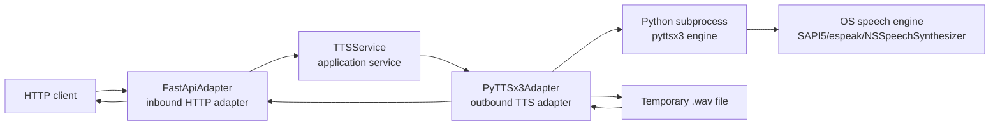
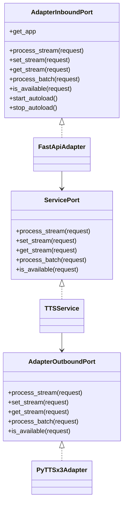
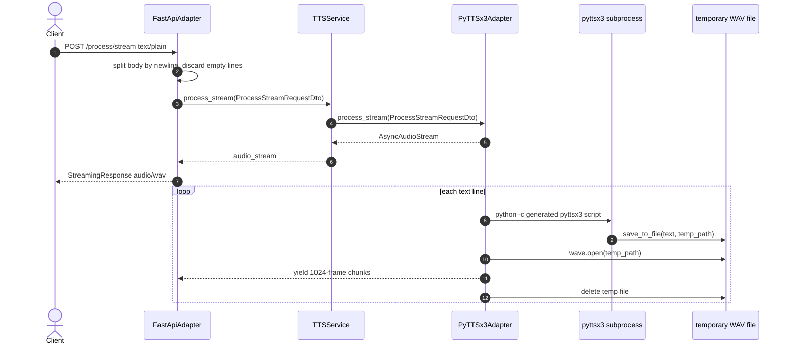

# TTS Microservice Technical README

This README is a technical knowledge-transfer document for the current `tts_microservice` codebase. It is based on repository inspection of the Python source, configuration files, tests, and checked-in runtime artifacts.

Where behavior is not explicit in code, it is marked as **Inferred** or **Needs verification**.

## Project Overview

This project implements a small Text-to-Speech HTTP microservice. It exposes a FastAPI server that accepts text, synthesizes speech using `pyttsx3`, and returns audio either as an HTTP streaming response or as a JSON payload containing base64 audio data.

The code is organized around a ports-and-adapters, or hexagonal, architecture:

- Inbound adapter: FastAPI HTTP API in `infrastructure/inbound/http/fastapi_adapter.py`.
- Application service: orchestration layer in `application/services/service.py`.
- Outbound adapter: `pyttsx3`-backed TTS engine in `infrastructure/outbound/tts/pyttsx3_adapter.py`.
- Composition root: dependency wiring and server startup in `composition_root/`.

Main responsibilities:

- Start a FastAPI application through Uvicorn.
- Load runtime configuration from `.env`.
- Accept plain text through HTTP endpoints.
- Convert text lines into async text streams.
- Synthesize audio with `pyttsx3` in isolated subprocesses.
- Stream generated WAV frame bytes back to clients.
- Support a decoupled two-step streaming flow where one request starts synthesis and another request drains the generated audio queue.
- Provide basic health and TTS availability checks.

Core business logic:

- Text input is split on newline boundaries.
- Empty lines are discarded.
- Each non-empty text line is synthesized independently.
- Synthesis writes a temporary `.wav` file through `pyttsx3`.
- The service reads the temporary WAV file with Python's `wave` module in 1024-frame chunks.
- Chunks are placed on an `asyncio.Queue` or yielded through an async iterator.
- A `None` sentinel indicates end-of-stream for queue-backed audio streams.

Main workflows and lifecycle:

1. `main.py` calls `asyncio.run(setup())`.
2. `setup()` loads `.env`, reads `SERVICE_HOST` and `SERVICE_PORT`, builds the dependency container, and starts a Uvicorn server.
3. `BuildContainer()` creates a `TTSDependency` graph.
4. `generate_tts_dependency()` creates `PyTTSx3Adapter`, `TTSService`, a FastAPI app, and `FastApiAdapter`.
5. FastAPI routes call adapter methods, which map inbound DTOs to service DTOs.
6. `TTSService` maps service DTOs to outbound DTOs and delegates to `PyTTSx3Adapter`.
7. The outbound adapter invokes `pyttsx3` in subprocesses and returns audio bytes.
8. On shutdown, Uvicorn exits, FastAPI lifespan calls `stop_autoload()`, and `setup()` calls `_cleanup()`.

## Architecture

### High-Level Architecture



### Component Relationships



### Internal Modules and Responsibilities

`main.py`

- Minimal process entry point.
- Runs `composition_root.setup.setup()` inside `asyncio.run`.
- Catches `KeyboardInterrupt` and prints an exit message.

`composition_root/setup/setup.py`

- Loads `.env` using `python-dotenv`.
- Reads `SERVICE_HOST` and `SERVICE_PORT`.
- Builds the dependency graph.
- Creates and runs `uvicorn.Server`.
- Configures Uvicorn `timeout_keep_alive=60`.
- Calls `_cleanup(container)` in a `finally` block.

`composition_root/containers/container.py`

- Defines immutable `Container`.
- Calls `generate_tts_dependency()`.

`composition_root/dependencies/tts_dependency.py`

- Reads outbound TTS config:
  - `TTS_SPEECH_RATE`, default `140`
  - `TTS_VOICE_NAME`, default `Zira`
- Creates:
  - `PyTTSx3Adapter`
  - `TTSService`
  - `FastAPI`
  - `FastApiAdapter`
- Configures FastAPI metadata and built-in docs:
  - `/docs`
  - `/redoc`
  - `/openapi.json`
- Defines FastAPI lifespan that calls `adapter_inbound.start_autoload()` on startup and `adapter_inbound.stop_autoload()` on shutdown. Both adapter methods are currently no-ops.

`application/ports/`

- Defines abstract interfaces for the inbound adapter, outbound adapter, and application service.
- These interfaces are useful extension points for replacing HTTP or TTS implementations.

`application/dtos/`

- Defines dataclass DTOs for each architectural boundary:
  - `adapter_inbound_dtos.py`
  - `services_dtos.py`
  - `adapter_outbound_dtos.py`
- The DTO files intentionally duplicate shapes per layer, then mapper modules translate between them.

`application/dtos/mapper/`

- Contains explicit mapping functions between inbound, service, and outbound DTOs.
- Current mappings are field copies with no validation or enrichment.

`application/services/service.py`

- Implements `TTSService`.
- Does not perform synthesis itself.
- Orchestrates by mapping service DTOs to outbound DTOs, calling the outbound port, then mapping outbound responses back to service responses.

`infrastructure/inbound/http/fastapi_adapter.py`

- Implements `AdapterInboundPort`.
- Registers all FastAPI routes.
- Parses HTTP request bodies and query parameters.
- Converts raw request data into inbound DTOs.
- Returns `JSONResponse` or `StreamingResponse`.

`infrastructure/outbound/tts/pyttsx3_adapter.py`

- Implements `AdapterOutboundPort`.
- Uses `pyttsx3` through dynamically generated Python scripts executed in subprocesses.
- Writes synthesis output to temporary WAV files.
- Reads WAV frames into async queues and async iterators.
- Stores one shared queue for the decoupled `set_stream` / `get_stream` flow.

### Dependency Graph

Text form:

```text
main.py
  -> composition_root.setup.setup
      -> dotenv
      -> uvicorn
      -> composition_root.containers.container.BuildContainer
          -> composition_root.dependencies.tts_dependency.generate_tts_dependency
              -> FastAPI
              -> PyTTSx3Adapter
                  -> pyttsx3 in subprocess
                  -> tempfile / wave / asyncio subprocess
              -> TTSService
              -> FastApiAdapter
```

### Streaming Data Flow



## Repository Structure

```text
tts_microservice/
  .env
  .vscode/
    launch.json
    settings.json
  application/
    dtos/
      adapter_inbound_dtos.py
      adapter_outbound_dtos.py
      services_dtos.py
      mapper/
    ports/
      adapter_inbound_port.py
      adapter_outbound_port.py
      service_port.py
    services/
      service.py
  composition_root/
    containers/
      container.py
    dependencies/
      tts_dependency.py
    setup/
      setup.py
  infrastructure/
    inbound/http/
      fastapi_adapter.py
    outbound/tts/
      pyttsx3_adapter.py
  tests/
    simple.py
    test_decoupled_stream.py
  windows/
  main.py
  README_STREAMING.md
  requirements.linux.txt
  requirements.windows.txt
```

Important folders and files:

| Path | Purpose |
| --- | --- |
| `main.py` | Process entry point. Runs async setup. |
| `.env` | Local runtime defaults for host, port, speech rate, and voice name. |
| `.vscode/launch.json` | VS Code debug/run profiles. References `windows/Scripts/python.exe` and `.env.production` for production. |
| `.vscode/settings.json` | Sets default interpreter to the checked-in `windows` virtual environment. |
| `application/ports/` | Abstract contracts for inbound, service, and outbound layers. |
| `application/dtos/` | Dataclass request/response objects for each boundary. |
| `application/dtos/mapper/` | DTO conversion functions. |
| `application/services/service.py` | Application orchestration layer. |
| `composition_root/` | Dependency injection and app/server bootstrap. |
| `infrastructure/inbound/http/fastapi_adapter.py` | FastAPI route definitions and HTTP request/response handling. |
| `infrastructure/outbound/tts/pyttsx3_adapter.py` | TTS synthesis implementation using `pyttsx3`, subprocesses, temp files, and queues. |
| `tests/simple.py` | Manual end-to-end integration test for health, availability, batch, and streaming endpoints. Requires server running. |
| `tests/test_decoupled_stream.py` | Manual end-to-end integration test for decoupled stream endpoints. Requires server running. |
| `README_STREAMING.md` | Existing detailed streaming architecture note. |
| `windows/` | Checked-in Windows virtual environment and installed packages. This is generated dependency state, not project source. |

Entry points:

- Runtime entry point: `python main.py`
- HTTP app object: `container.tts_dependency.adapter_inbound.get_app`
- Test scripts:
  - `python tests/simple.py`
  - `python tests/test_decoupled_stream.py`

Code reference map:

| Concern | Source location |
| --- | --- |
| Process entry point | `main.py` |
| Environment loading and Uvicorn server creation | `composition_root/setup/setup.py` |
| FastAPI app construction and dependency graph | `composition_root/dependencies/tts_dependency.py` |
| Route registration | `infrastructure/inbound/http/fastapi_adapter.py`, `FastApiAdapter.register_routes()` |
| `GET /health` | `infrastructure/inbound/http/fastapi_adapter.py`, `health_check()` |
| `GET /available` | `infrastructure/inbound/http/fastapi_adapter.py`, `handle_check_availability()` |
| `POST /process/stream` | `infrastructure/inbound/http/fastapi_adapter.py`, `handle_process_stream()` |
| `POST /process/stream/set` | `infrastructure/inbound/http/fastapi_adapter.py`, `handle_set_stream()` |
| `GET /process/stream/get` | `infrastructure/inbound/http/fastapi_adapter.py`, `handle_get_stream()` |
| `POST /process/batch` | `infrastructure/inbound/http/fastapi_adapter.py`, `handle_process_batch()` |
| Application orchestration | `application/services/service.py`, `TTSService` |
| DTO mapping | `application/dtos/mapper/` |
| TTS subprocess execution | `infrastructure/outbound/tts/pyttsx3_adapter.py`, `_run_tts_subprocess()` |
| Per-request streaming iterator | `infrastructure/outbound/tts/pyttsx3_adapter.py`, `AsyncAudioStream` |
| Decoupled queue stream iterator | `infrastructure/outbound/tts/pyttsx3_adapter.py`, `DecoupledAudioStream` |
| Outbound adapter state and synthesis methods | `infrastructure/outbound/tts/pyttsx3_adapter.py`, `PyTTSx3Adapter` |

## Runtime Flow

### Startup Sequence

1. `main.py` imports `setup` and calls `asyncio.run(setup())`.
2. `setup()` searches for `.env` using `find_dotenv('.env')`.
3. If found, `.env` is loaded.
4. `SERVICE_HOST` is read, defaulting to `127.0.0.1`.
5. `SERVICE_PORT` is read, defaulting to `8002`.
6. `BuildContainer(name="TTS Microservice")` builds dependencies.
7. `generate_tts_dependency()` reads `TTS_SPEECH_RATE` and `TTS_VOICE_NAME`.
8. `PyTTSx3Adapter` is created.
9. `TTSService` is created with the outbound adapter.
10. FastAPI app is created with docs enabled.
11. `FastApiAdapter` is created and registers routes on the FastAPI app.
12. Uvicorn server is created and `server.serve()` blocks until shutdown.

### Initialization Process

There is no eager TTS engine initialization during app startup. `pyttsx3` is initialized lazily inside subprocesses when:

- `/available` checks engine availability.
- `/process/stream` synthesizes each input line.
- `/process/stream/set` starts background synthesis.
- `/process/batch` attempts batch synthesis.

### Service Registration

`FastApiAdapter.register_routes()` defines all routes directly with decorators inside the method. There is no `APIRouter`; all endpoints are registered directly on the FastAPI app instance.

### Request Lifecycle

Generic lifecycle:

```text
HTTP request
  -> FastAPI route handler
  -> inbound DTO
  -> inbound-to-service mapper
  -> TTSService method
  -> service-to-outbound mapper
  -> PyTTSx3Adapter method
  -> outbound-to-service mapper
  -> service-to-inbound mapper
  -> JSONResponse or StreamingResponse
```

Streaming lifecycle:

- The HTTP adapter reads the full request body with `await request.body()`.
- It decodes the body as UTF-8.
- It splits text on `\n`.
- It strips each line and drops empty lines.
- It wraps the resulting list in an async generator.
- The outbound adapter creates an async audio stream and a background generation task.
- Each text line produces a separate temporary WAV file.
- WAV frames are yielded to the HTTP response.

Decoupled stream lifecycle:

- `POST /process/stream/set` parses the text and calls `PyTTSx3Adapter.set_stream()`.
- The adapter cancels any previous background generation task.
- It replaces the shared `_audio_queue`.
- It starts `_generate_decoupled_audio()` in an `asyncio.create_task`.
- `GET /process/stream/get` returns a `DecoupledAudioStream` that drains the current shared queue.

### Shutdown Behavior

Shutdown handling exists but is minimal:

- `KeyboardInterrupt` is caught in `main.py`.
- `setup()` always calls `_cleanup(container)` after `server.serve()` finishes.
- `_cleanup()` currently only prints `"Performing graceful shutdown cleanup..."`.
- FastAPI lifespan calls `adapter_inbound.stop_autoload()`, but that method is a no-op.
- **Needs verification:** active `AsyncAudioStream` generation tasks created per streaming request are not centrally tracked for shutdown.
- **Needs verification:** active `PyTTSx3Adapter._generator_task` for decoupled streaming is not explicitly cancelled during shutdown.

## Ports & Interfaces

### Quick Port Reference

- Main HTTP service:
  - Host: `SERVICE_HOST`, default `127.0.0.1`
  - Port: `SERVICE_PORT`, default `8002`
  - Protocol: HTTP through Uvicorn/FastAPI
  - Auth: none
- OpenAPI docs:
  - `GET /docs`
  - `GET /redoc`
  - `GET /openapi.json`
- Primary synthesis endpoints:
  - `POST /process/stream` - plain text body to streamed WAV bytes
  - `POST /process/stream/set` - plain text body to background synthesis queue
  - `GET /process/stream/get` - drain background synthesis queue as streamed WAV bytes
  - `POST /process/batch?text=...` - query-param batch text to JSON with `audio_data_base64`
- Health endpoints:
  - `GET /health`
  - `GET /available`

### Interface Table

| Type | Port | Protocol | Path/Topic | Purpose | Handler | Dependencies |
| --- | ---: | --- | --- | --- | --- | --- |
| HTTP | `SERVICE_PORT`, default `8002` | HTTP | `GET /health` | Liveness-style service check | `health_check()` in `FastApiAdapter.register_routes()` | None beyond FastAPI |
| HTTP | `SERVICE_PORT`, default `8002` | HTTP | `GET /available` | Check whether `pyttsx3` can initialize | `handle_check_availability()` | `TTSService.is_available()`, `PyTTSx3Adapter.is_available()`, subprocess, `pyttsx3` |
| HTTP | `SERVICE_PORT`, default `8002` | HTTP | `POST /process/stream` | Synthesize newline-delimited text and stream audio in same request | `handle_process_stream()` | `TTSService.process_stream()`, `PyTTSx3Adapter.process_stream()`, temp WAV files, subprocess, OS TTS engine |
| HTTP | `SERVICE_PORT`, default `8002` | HTTP | `POST /process/stream/set` | Start background synthesis for a single shared decoupled stream | `handle_set_stream()` | `TTSService.set_stream()`, `PyTTSx3Adapter.set_stream()`, shared queue, subprocess, temp WAV files |
| HTTP | `SERVICE_PORT`, default `8002` | HTTP | `GET /process/stream/get` | Stream audio from the current shared decoupled queue | `handle_get_stream()` | `TTSService.get_stream()`, `PyTTSx3Adapter.get_stream()`, shared queue |
| HTTP | `SERVICE_PORT`, default `8002` | HTTP | `POST /process/batch` | Attempt batch synthesis and return base64 audio JSON | `handle_process_batch()` | `TTSService.process_batch()`, `PyTTSx3Adapter.process_batch()`, subprocess, temp WAV files |
| HTTP | `SERVICE_PORT`, default `8002` | HTTP | `GET /docs` | Swagger UI generated by FastAPI | FastAPI built-in | OpenAPI schema |
| HTTP | `SERVICE_PORT`, default `8002` | HTTP | `GET /redoc` | ReDoc generated by FastAPI | FastAPI built-in | OpenAPI schema |
| HTTP | `SERVICE_PORT`, default `8002` | HTTP | `GET /openapi.json` | OpenAPI JSON schema | FastAPI built-in | Route metadata |
| CLI | N/A | Local process | `python main.py` | Start server | `main.py` | `.env`, Uvicorn, dependency graph |
| CLI | N/A | Local process | `python tests/simple.py` | Manual integration test | `tests/simple.py` | Running service at `http://127.0.0.1:8002` |
| CLI | N/A | Local process | `python tests/test_decoupled_stream.py` | Manual decoupled stream integration test | `tests/test_decoupled_stream.py` | Running service, `TTS_TEST_BASE_URL` optional |

No GraphQL operations, WebSocket events, MQTT topics, serial ports, gRPC services, message queues, file watchers, webhooks, cron jobs, scheduled jobs, or internal event buses were found in the project source. The only internal async coordination primitive is `asyncio.Queue` inside `PyTTSx3Adapter`.

### `GET /health`

- Port: `SERVICE_PORT`, default `8002`
- Protocol: HTTP
- Purpose: Basic service health response.
- Authentication: none.
- Request format: no body.
- Response format: JSON envelope.
- Internal handler: `health_check()` in `FastApiAdapter.register_routes()`.
- Dependencies triggered: none beyond FastAPI.
- Side effects: none.
- Required environment variables: none beyond server bind config.
- Failure behavior: no explicit error handling in handler; ordinary FastAPI exception handling applies if unexpected failure occurs.
- Timeout/retry behavior: no app-level timeout or retry.

Example:

```bash
curl http://127.0.0.1:8002/health
```

Example response:

```json
{
  "action": "health_check",
  "status": "success",
  "status_code": 200,
  "message": "Service is healthy",
  "timestamp": 1710000000.0,
  "data": null
}
```

### `GET /available`

- Port: `SERVICE_PORT`, default `8002`
- Protocol: HTTP
- Purpose: Check whether the local TTS engine can initialize.
- Authentication: none.
- Request format: no body.
- Response format: JSON envelope with `data.is_available`.
- Internal handler: `handle_check_availability()`.
- Dependencies triggered:
  - `TTSService.is_available()`
  - `PyTTSx3Adapter.is_available()`
  - subprocess using `sys.executable -c "import pyttsx3; engine = pyttsx3.init(); del engine"`
- Side effects:
  - Spawns a subprocess.
  - Initializes the OS TTS engine in that subprocess.
- Required environment variables: none directly.
- Failure behavior:
  - If subprocess returns non-zero, response still has HTTP 200 with `is_available: false`.
  - If handler raises, returns HTTP 500 JSON envelope.
- Timeout/retry behavior:
  - No explicit timeout.
  - No retry.

Example:

```bash
curl http://127.0.0.1:8002/available
```

Example response:

```json
{
  "action": "check_availability",
  "status": "success",
  "status_code": 200,
  "message": "Availability checked successfully",
  "timestamp": 1710000000.0,
  "data": {
    "is_available": true
  }
}
```

### `POST /process/stream`

- Port: `SERVICE_PORT`, default `8002`
- Protocol: HTTP
- Purpose: Synthesize a newline-delimited text payload and return streamed audio bytes.
- Authentication: none.
- Request format:
  - Body: UTF-8 plain text.
  - Lines are split with `body_str.split("\n")`.
  - Empty or whitespace-only lines are dropped.
  - Query parameters:
    - `sample_rate`, default `22050`
    - `channels`, default `1`
- Response format:
  - `StreamingResponse`
  - `Content-Type`: `audio/wav`
  - Headers:
    - `Cache-Control: no-cache`
    - `Connection: keep-alive`
    - `X-Action: process_stream`
    - `X-Status: success`
    - `X-Message: Stream processed successfully`
    - `X-Timestamp: <unix timestamp>`
- Internal handler: `handle_process_stream()`.
- Dependencies triggered:
  - `TTSService.process_stream()`
  - `PyTTSx3Adapter.process_stream()`
  - `AsyncAudioStream`
  - `_run_tts_subprocess()`
  - `pyttsx3`
  - OS TTS engine
  - temporary file system
- Side effects:
  - Creates one temporary `.wav` file per text line.
  - Spawns one subprocess per text line.
  - Deletes each temporary WAV file after streaming.
  - Logs generated subprocess script, PID, and stdout to process stdout.
- Required environment variables:
  - `TTS_SPEECH_RATE`, optional, default `140`
  - `TTS_VOICE_NAME`, optional, default `Zira`
- Failure behavior:
  - If route setup or initial processing raises, returns HTTP 500 JSON envelope.
  - If errors occur after streaming begins inside the async generator, client behavior is governed by ASGI streaming semantics. **Needs verification:** no explicit mid-stream error envelope is possible once bytes start streaming.
  - `_run_tts_subprocess()` returns an exception object instead of raising it to the caller. Current callers do not inspect the return value, so a failed subprocess can lead to a later `wave.open()` failure or empty/missing output.
- Timeout/retry behavior:
  - No explicit synthesis timeout.
  - No retry.
  - Uvicorn keep-alive timeout is 60 seconds.
  - `await asyncio.sleep(0.001)` is used between chunks to yield event-loop control.

Example:

```bash
curl -X POST "http://127.0.0.1:8002/process/stream?sample_rate=22050&channels=1" \
  -H "Content-Type: text/plain" \
  --data-binary $'Hello from line one.\nHello from line two.' \
  --output speech.wav
```

Expected response:

- HTTP 200
- Body is streamed WAV frame bytes.
- **Needs verification:** the streamed body contains frame data read from WAV files, but the implementation reads with `wave.readframes()` and does not explicitly prepend a WAV container header to the HTTP stream.

### `POST /process/stream/set`

- Port: `SERVICE_PORT`, default `8002`
- Protocol: HTTP
- Purpose: Submit text for background synthesis into one shared decoupled audio queue.
- Authentication: none.
- Request format:
  - Body: UTF-8 plain text.
  - Newline-delimited text.
  - Query parameters:
    - `sample_rate`, default `22050`
    - `channels`, default `1`
- Response format: JSON envelope with HTTP 202.
- Internal handler: `handle_set_stream()`.
- Dependencies triggered:
  - `TTSService.set_stream()`
  - `PyTTSx3Adapter.set_stream()`
  - `_generate_decoupled_audio()` background task
  - `_run_tts_subprocess()`
- Side effects:
  - Cancels any previous decoupled synthesis task.
  - Replaces `_audio_queue`, discarding any stale/unconsumed chunks.
  - Starts a new background `asyncio.Task`.
  - Creates and deletes temporary WAV files.
- Required environment variables:
  - `TTS_SPEECH_RATE`, optional, default `140`
  - `TTS_VOICE_NAME`, optional, default `Zira`
- Failure behavior:
  - Handler returns HTTP 500 JSON envelope if setup fails.
  - Background task catches `asyncio.CancelledError`.
  - Background task always places `None` sentinel on the queue in `finally`.
- Timeout/retry behavior:
  - No explicit timeout.
  - No retry.

Example:

```bash
curl -X POST http://127.0.0.1:8002/process/stream/set \
  -H "Content-Type: text/plain" \
  --data-binary $'First sentence.\nSecond sentence.'
```

Example response:

```json
{
  "action": "set_stream",
  "status": "accepted",
  "status_code": 202,
  "message": "Stream accepted. Background synthesis started.",
  "timestamp": 1710000000.0,
  "data": null
}
```

### `GET /process/stream/get`

- Port: `SERVICE_PORT`, default `8002`
- Protocol: HTTP
- Purpose: Retrieve audio chunks from the current decoupled audio queue.
- Authentication: none.
- Request format: no body.
- Response format:
  - `StreamingResponse`
  - `Content-Type`: `audio/wav`
  - Headers:
    - `Cache-Control: no-cache`
    - `Connection: keep-alive`
    - `X-Action: get_stream`
    - `X-Status: success`
    - `X-Message: Decoupled stream retrieved successfully`
    - `X-Timestamp: <unix timestamp>`
- Internal handler: `handle_get_stream()`.
- Dependencies triggered:
  - `TTSService.get_stream()`
  - `PyTTSx3Adapter.get_stream()`
  - `DecoupledAudioStream`
- Side effects:
  - Drains `_audio_queue`.
  - Multiple clients would compete for chunks from the same queue. **Inferred:** this is a single-consumer or competing-consumer model, not broadcast.
- Required environment variables: none directly.
- Failure behavior:
  - If no stream has been set, the handler returns an iterator over the current empty queue and may wait indefinitely for chunks. **Needs verification.**
  - If handler setup fails, returns HTTP 500 JSON envelope.
  - End-of-stream occurs when `None` sentinel is read.
- Timeout/retry behavior:
  - No explicit timeout.
  - No retry.
  - Uvicorn keep-alive timeout is 60 seconds.

Example:

```bash
curl http://127.0.0.1:8002/process/stream/get --output speech.wav
```

Expected response:

- HTTP 200
- Streaming audio bytes from the shared queue.

### `POST /process/batch`

- Port: `SERVICE_PORT`, default `8002`
- Protocol: HTTP
- Purpose: Synthesize a complete text string and return base64 audio data in JSON.
- Authentication: none.
- Request format:
  - `text` is declared as a plain function parameter, not as a Pydantic body model.
  - In FastAPI, this means `text` is expected as a query parameter unless otherwise annotated.
  - Query parameters:
    - `text`, default `""`
    - `sample_rate`, default `22050`
    - `channels`, default `1`
- Response format: JSON envelope with `data.audio_data_base64`, `sample_rate`, and `channels`.
- Internal handler: `handle_process_batch()`.
- Dependencies triggered:
  - `TTSService.process_batch()`
  - `PyTTSx3Adapter.process_batch()`
  - `_run_tts_subprocess()`
  - temporary WAV file
- Side effects:
  - Creates and deletes a temporary WAV file.
  - Current outbound implementation also writes batch chunks into the shared `_audio_queue`, which may interfere with decoupled streaming. This appears unintended.
- Required environment variables:
  - `TTS_SPEECH_RATE`, optional, default `140`
  - `TTS_VOICE_NAME`, optional, default `Zira`
- Failure behavior:
  - If `text` is empty, route raises `HTTPException(400)`, but the broad `except Exception` catches it and returns HTTP 500 instead of HTTP 400.
  - **Known bug:** `PyTTSx3Adapter.process_batch()` reads all frames into a loop and returns `data` after the loop has ended, so the returned `audio_data` is the final empty buffer (`b""`). This means `audio_data_base64` is likely empty even after successful synthesis.
  - The included `tests/simple.py` sends JSON `{"text": ...}`, which does not match the current FastAPI signature and will not populate `text`.
- Timeout/retry behavior:
  - No explicit timeout.
  - No retry.

Example matching current FastAPI signature:

```bash
curl -X POST "http://127.0.0.1:8002/process/batch?text=Hello%20world&sample_rate=22050&channels=1"
```

Example intended response shape:

```json
{
  "action": "process_batch",
  "status": "success",
  "status_code": 200,
  "message": "Text synthesized successfully",
  "timestamp": 1710000000.0,
  "data": {
    "audio_data_base64": "...",
    "sample_rate": 22050,
    "channels": 1
  }
}
```

**Needs verification:** because of the current outbound bug, the actual `audio_data_base64` may be empty.

### Built-In FastAPI Documentation Interfaces

`GET /docs`, `GET /redoc`, and `GET /openapi.json` are enabled in `composition_root/dependencies/tts_dependency.py`.

- Port: `SERVICE_PORT`, default `8002`
- Protocol: HTTP
- Authentication: none
- Purpose: inspect API schema and interact with endpoints.
- Side effects: none.
- Failure behavior: FastAPI default behavior.

### CLI Interfaces

`python main.py`

- Starts the service.
- Reads `.env`.
- Binds Uvicorn to `SERVICE_HOST:SERVICE_PORT`.

`python tests/simple.py`

- Manual integration test.
- Assumes the server is already running at `http://127.0.0.1:8002`.
- Tests `/health`, `/available`, `/process/batch`, and `/process/stream`.
- **Needs verification:** the batch part currently sends JSON, but the endpoint expects `text` as a query parameter.

`python tests/test_decoupled_stream.py`

- Manual integration test.
- Assumes the server is already running.
- Uses `TTS_TEST_BASE_URL`, default `http://127.0.0.1:8002`.
- Posts text to `/process/stream/set`.
- Streams bytes from `/process/stream/get`.

## Outbound Integrations

### `pyttsx3`

- Purpose: local text-to-speech synthesis.
- How it is used:
  - Dynamically generated Python code imports `pyttsx3`, initializes the engine, sets speech rate, selects a voice, calls `engine.save_to_file(text, file_path)`, and runs `engine.runAndWait()`.
  - Code is executed through `asyncio.create_subprocess_exec(sys.executable, "-c", script)`.
- Authentication: none.
- Retry behavior: none.
- Failure modes:
  - `pyttsx3.init()` fails.
  - Required native speech backend is missing or misconfigured.
  - Voice preference does not match an installed voice.
  - Subprocess exits non-zero.
  - Generated temp file is missing, empty, or invalid.
- Required configs:
  - `TTS_SPEECH_RATE`
  - `TTS_VOICE_NAME`

### OS Native TTS Backend

`pyttsx3` delegates to native speech engines depending on platform.

- Windows: likely SAPI5. The existing `README_STREAMING.md` explicitly discusses SAPI5 and COM isolation.
- Linux: typically `espeak` or related system packages. **Needs verification:** no OS package installation script exists in this repository.
- macOS: typically NSSpeechSynthesizer. **Needs verification:** not tested in this repository.

Authentication: none.

Failure modes:

- Missing native speech engine.
- No matching voice.
- COM/threading issues on Windows if not isolated. This code mitigates that by using subprocesses.

### Temporary File System

- Purpose: bridge `pyttsx3.save_to_file()` output into Python audio streaming.
- How it is used:
  - `tempfile.NamedTemporaryFile(suffix=".wav", delete=False)` creates a file path.
  - `pyttsx3` writes to that path in a subprocess.
  - Main process opens the file with `wave.open()`.
  - File is deleted in `finally`.
- Authentication: OS file permissions.
- Retry behavior: none.
- Failure modes:
  - No temp directory permissions.
  - Disk full.
  - File deletion failure. Deletion errors are swallowed.

### Network Dependencies

No outbound HTTP APIs, databases, SaaS APIs, cloud services, message brokers, or hardware network devices were found.

## Data Model

There is no database schema and no persistent domain model. The service uses dataclass DTOs to describe request and response shapes across layers.

Key entities:

| Entity | Location | Fields | Purpose |
| --- | --- | --- | --- |
| `InitOutboundAdapterDto` | `application/dtos/adapter_outbound_dtos.py` | `speech_rate`, `voice_name_preference` | Configures `PyTTSx3Adapter`. |
| `InitInboundAdapterDto` | `application/dtos/adapter_inbound_dtos.py` | none | Placeholder for inbound adapter config. |
| `ProcessStreamRequestDto` | all DTO layers | `text_stream`, `sample_rate`, `channels` | Streaming synthesis input. |
| `ProcessStreamResponseDto` | all DTO layers | `audio_stream` | Streaming synthesis output. |
| `SetStreamRequestDto` | all DTO layers | `text_stream`, `sample_rate`, `channels` | Decoupled background synthesis input. |
| `GetStreamRequestDto` | all DTO layers | none | Request to retrieve decoupled stream. |
| `GetStreamResponseDto` | all DTO layers | `audio_stream` | Decoupled stream output. |
| `ProcessBatchRequestDto` | all DTO layers | `text`, `sample_rate`, `channels` | Batch synthesis input. |
| `ProcessBatchResponseDto` | all DTO layers | `audio_data` | Batch synthesis output. |
| `TTSAvailabilityRequestDto` | all DTO layers | none | Availability check request. |
| `TTSAvailabilityResponseDto` | all DTO layers | `is_available` | Availability check result. |

Relationships:

- Inbound DTOs map to service DTOs.
- Service DTOs map to outbound DTOs.
- Outbound responses map back to service responses.
- Service responses map back to inbound responses.

Caching strategy:

- No explicit cache exists.
- The decoupled stream queue temporarily stores audio chunks in memory until consumed.

Database structure:

- No database code, migrations, connection strings, ORM, or SQL was found.

## Configuration

Configuration sources:

- VS Code launch configuration in `.vscode/launch.json` is the primary execution-environment definition.
- Each launch profile declares `APP_ENV`, `VSCODE_LAUNCH_PROFILE`, and an `envFile`.
- Process environment variables are used at runtime. When launched from VS Code, these include values from the selected profile's `env` and `envFile`.
- `.env`, `.env.staging`, and `.env.production` hold profile-specific runtime defaults for host, port, speech rate, and voice name.

Runtime environment resolution:

- Supported values are `development`, `staging`, and `production`.
- Precedence is `VSCODE_ENV`, then `APP_ENV`, then `VSCODE_LAUNCH_PROFILE` mapped through `.vscode/launch.json`.
- `env` values in a launch profile override values from that profile's `envFile`.
- `debug`, `dev`, `stage`, and `prod` are accepted aliases for `development`, `development`, `staging`, and `production`.
- Missing or invalid environment values fall back to `development`, the safe default with full local diagnostics.

Launch profile environment mapping:

| Launch profile | `envFile` | Environment |
| --- | --- | --- |
| `Python: Debug (development env)` | `.env` | `development` |
| `Python: Run (staging env)` | `.env.staging` | `staging` |
| `Python: Run (production env)` | `.env.production` | `production` |

Logging behavior:

| Environment | Enabled levels |
| --- | --- |
| `development` | `trace`, `info`, `warn`, `error`, `critical` |
| `staging` | `warn`, `error`, `critical` |
| `production` | `critical` |

Every application log line includes timestamp, environment, level, and module scope.

Environment variables:

| Variable | Required | Default | Purpose | Example |
| --- | --- | --- | --- | --- |
| `VSCODE_ENV` | No | `development` | Highest-precedence runtime environment override. | `staging` |
| `APP_ENV` | No | `development` | Launch-profile runtime environment. | `development` |
| `VSCODE_LAUNCH_PROFILE` | No | None | Optional launch profile name used to map `.vscode/launch.json` to an environment. | `Python: Run (production env)` |
| `SERVICE_HOST` | No | `127.0.0.1` | Host/interface passed to Uvicorn. | `0.0.0.0` |
| `SERVICE_PORT` | No | `8002` | TCP port passed to Uvicorn. | `8002` |
| `TTS_SPEECH_RATE` | No | `140` | Speech rate passed to `engine.setProperty('rate', ...)`. Must parse as integer. | `140` |
| `TTS_VOICE_NAME` | No | `Zira` | Preferred voice name substring used during voice selection. | `Zira` |
| `TTS_TEST_BASE_URL` | No | `http://127.0.0.1:8002` | Used only by `tests/test_decoupled_stream.py`. | `http://127.0.0.1:8002` |

Config files:

| File | Purpose |
| --- | --- |
| `.env` | Development runtime config for host, port, speech rate, and voice name. |
| `.env.staging` | Staging runtime config for host, port, speech rate, and voice name. |
| `.env.production` | Production runtime config for host, port, speech rate, and voice name. |
| `infrastructure/config.py` | Runtime environment resolver that reads process env and `.vscode/launch.json`. |
| `infrastructure/logger.py` | Centralized Logger utility and environment-specific logging setup. |
| `requirements.windows.txt` | Python dependency list for Windows. |
| `requirements.linux.txt` | Python dependency list for Linux. Same contents as Windows at inspection time. |
| `.vscode/launch.json` | Development, staging, and production launch profiles. |
| `.vscode/settings.json` | VS Code interpreter settings. |

Secrets:

- No secrets are required by current code.
- No authentication credentials or API keys were found.

Important config caveats:

- `TTS_SPEECH_RATE` is cast with `int(...)`; non-integer values will fail container construction.
- To add a new launch profile, copy an existing profile in `.vscode/launch.json`, set `APP_ENV` or `VSCODE_ENV` to one of the supported environments, set `VSCODE_LAUNCH_PROFILE` to the profile name, and point `envFile` at the matching env file.
- To add a new environment beyond `development`, `staging`, or `production`, update `SUPPORTED_ENVIRONMENTS` in `infrastructure/config.py`, add the logging threshold in `infrastructure/logger.py`, and create/update the relevant VS Code launch profile and env file.

## Build & Deployment

### Run Locally

Windows using the checked-in virtual environment:

```powershell
.\windows\Scripts\python.exe main.py
```

Generic Python environment:

```powershell
python -m venv .venv
.\.venv\Scripts\Activate.ps1
pip install -r requirements.windows.txt
python main.py
```

Linux:

```bash
python -m venv .venv
. .venv/bin/activate
pip install -r requirements.linux.txt
python main.py
```

**Needs verification:** Linux may require native `espeak` packages for `pyttsx3` to work. No apt/yum/apk package instructions are included in this repository.

### Build

No package build configuration was found:

- No `pyproject.toml`
- No `setup.py` package metadata
- No Dockerfile
- No Makefile
- No lock file

The project is run directly from source.

### Docker Usage

No Dockerfile or Compose file was found.

If containerizing this service later, preserve these requirements:

- Install Python dependencies from requirements file.
- Install the OS TTS backend required by `pyttsx3`.
- Ensure subprocess execution is allowed.
- Ensure a writable temp directory exists.
- Expose `SERVICE_PORT`, default `8002`.

### CI/CD Behavior

No CI/CD configuration was found:

- No `.github/workflows`
- No GitLab CI config
- No Azure Pipelines config
- No test runner config

### Production Deployment Assumptions

**Inferred:**

- The service is intended to run as a long-lived HTTP process.
- Deployment must provide local/native TTS capability, not a remote TTS API.
- The service should run on a host where `pyttsx3` can initialize a compatible speech backend.
- `SERVICE_HOST=0.0.0.0` is likely needed for container or remote access.

## Dependencies

Both `requirements.windows.txt` and `requirements.linux.txt` contain:

| Dependency | Constraint | Why used |
| --- | --- | --- |
| `fastapi` | `>=0.110.0` | HTTP API framework and OpenAPI docs. |
| `uvicorn` | `>=0.29.0` | ASGI server. |
| `python-dotenv` | `>=1.0.1` | Loading `.env` at startup. |
| `pydantic` | `>=2.6.4` | FastAPI dependency. Current DTOs use dataclasses, not Pydantic models. |
| `httpx` | `>=0.27.0` | Manual integration test client. |
| `pyttsx3` | `>=2.90` | Local TTS engine wrapper. |

Critical version constraints:

- No upper bounds are pinned.
- No lock file is present.
- **Needs verification:** compatibility with Python 3.14. The checked-in `windows` virtual environment appears to use Python 3.14 based on paths such as `.cpython-314.pyc` and `pip3.14.exe`.

## State & Persistence

Databases:

- None.

File storage:

- Temporary WAV files are created for each synthesis operation and deleted after use.
- Generated `.pyc` files and `__pycache__` directories are present.
- A full `windows` virtual environment is checked into the repository.

Cache:

- No cache layer.

Session management:

- No user sessions.
- No authentication sessions.

Persistent runtime state:

- `PyTTSx3Adapter` holds:
  - `_audio_queue`: shared queue for decoupled stream flow.
  - `_generator_task`: current background synthesis task for decoupled stream flow.
- This state is process-local and lost on restart.
- The decoupled queue is shared globally across all clients of the service instance.

## Failure & Recovery

Known failure points:

- `.env` values may be invalid, especially `SERVICE_PORT` and `TTS_SPEECH_RATE`, which are cast to integers.
- `pyttsx3` may fail to initialize.
- OS TTS backend may be unavailable.
- Voice selection may not find `TTS_VOICE_NAME`.
- Generated subprocess may fail.
- Temporary WAV file may not be created or may be invalid.
- `wave.open()` may fail on invalid/empty output.
- Long-running synthesis has no timeout.
- Decoupled `GET /process/stream/get` can wait on an empty queue if no stream is active. **Needs verification.**
- Multiple decoupled consumers compete for one shared queue. **Inferred.**
- Mid-stream errors are not converted into structured JSON because streaming responses may already be in progress.

Retry logic:

- None.

Error handling strategy:

- HTTP route handlers catch broad `Exception` and return JSON envelopes with HTTP 500.
- `is_available()` catches exceptions and returns `is_available=False`.
- Background generator tasks catch `asyncio.CancelledError`.
- Temporary file deletion ignores `OSError`.
- `_run_tts_subprocess()` catches exceptions and returns the exception object, but callers do not check it. This weakens error propagation.

Recovery mechanisms:

- Restarting the service resets process-local queues and background tasks.
- Calling `POST /process/stream/set` cancels the previous decoupled synthesis task and replaces the queue.
- Failed temp file deletion is ignored, so manual cleanup of OS temp directories may be needed if many failures occur.

## Security

Authentication:

- None.

Authorization:

- None.

Secrets handling:

- No secrets are currently used.
- `.env` is present in the repository and contains non-secret local config.

Sensitive flows:

- Text submitted to synthesis endpoints is passed into generated Python code through `repr(...)`, which prevents straightforward code injection through the text itself.
- The generated subprocess script is printed to stdout and includes the text being synthesized. This can leak user-provided text into logs.
- Temporary WAV files contain synthesized speech and exist briefly on disk.

Exposed attack surface:

- Unauthenticated HTTP endpoints can trigger CPU, process, disk, and native TTS work.
- Each input line can spawn a subprocess.
- Request bodies have no explicit size limit.
- Number of lines has no explicit limit.
- No rate limiting.
- No concurrency limit.
- No synthesis timeout.
- FastAPI docs are publicly exposed on the bind interface.

Recommended hardening for production:

- Add authentication or restrict network access.
- Add request size limits.
- Add line count and text length limits.
- Add subprocess timeouts.
- Add concurrency control around synthesis.
- Remove or reduce subprocess script logging.
- Consider disabling `/docs` and `/redoc` in production.
- Avoid checking virtual environments into source control.

## Tests

Current tests are script-style integration tests, not pytest tests.

`tests/simple.py`

- Uses `httpx.AsyncClient`.
- Hard-codes `BASE_URL = "http://127.0.0.1:8002"`.
- Requires the server to already be running.
- Tests:
  - `GET /health`
  - `GET /available`
  - `POST /process/batch`
  - `POST /process/stream`
- **Known mismatch:** sends JSON to `/process/batch`, but the endpoint currently expects `text` as a query parameter.

`tests/test_decoupled_stream.py`

- Uses `httpx.AsyncClient(timeout=60.0)`.
- Reads `TTS_TEST_BASE_URL`, defaulting to `http://127.0.0.1:8002`.
- Tests:
  - `POST /process/stream/set`
  - `GET /process/stream/get`
- Verifies at least one chunk and non-zero bytes.

There is no automated test configuration, no assertions around DTO mapping, and no unit tests for the outbound adapter.

## Derived Project Transfer Notes

Reusable parts:

- The ports-and-adapters layering is reusable.
- DTO mapping modules provide clear boundaries for replacing adapters.
- `TTSService` is mostly transport-agnostic and can remain stable.
- `FastApiAdapter` route structure can be reused for another TTS engine.
- `AdapterOutboundPort` is the key abstraction for swapping `pyttsx3` with cloud TTS, another local engine, or a mock engine.

Tightly coupled parts:

- `PyTTSx3Adapter` is tightly coupled to local subprocess execution, temp WAV files, and the behavior of `pyttsx3`.
- `README_STREAMING.md` and comments assume Windows SAPI5/COM behavior, though requirements include a Linux file too.
- `.vscode` settings are tightly coupled to the checked-in `windows` virtual environment.
- The decoupled streaming design is tightly coupled to a single shared in-memory queue.

Assumptions found in code:

- Text input is UTF-8.
- Text lines are independent synthesis units.
- WAV frame chunks can be streamed as `audio/wav` without explicit container header handling. **Needs verification.**
- `sample_rate` and `channels` are accepted at API boundaries but not applied to `pyttsx3` output. They are currently metadata/control placeholders.
- A preferred voice can be selected by checking whether `TTS_VOICE_NAME` is a substring of `voice.name` or whether `'en'` is in `voice.id`.
- The current Python executable has all dependencies needed for subprocess synthesis.

What must be preserved for compatibility:

- Default bind config: `127.0.0.1:8002`.
- Plain text input for `/process/stream` and `/process/stream/set`.
- Newline-delimited text splitting.
- Response envelope fields for JSON endpoints:
  - `action`
  - `status`
  - `status_code`
  - `message`
  - `timestamp`
  - `data`
- Streaming endpoints returning `audio/wav`.
- `/docs`, `/redoc`, and `/openapi.json` if clients rely on interactive docs.
- Decoupled flow contract:
  - set with `POST /process/stream/set`
  - retrieve with `GET /process/stream/get`

Recommended extension points:

- Replace `PyTTSx3Adapter` behind `AdapterOutboundPort` for alternative TTS providers.
- Add fields to `InitInboundAdapterDto` for HTTP-specific config.
- Add validation inside FastAPI handlers or DTO constructors.
- Add a Pydantic request model for batch synthesis if JSON body support is desired.
- Add a dedicated stream/session ID model if multiple concurrent decoupled streams are needed.
- Add a queue manager abstraction if decoupled streaming should support multiple clients.

Safe refactoring boundaries:

- DTO mapper functions can be consolidated, but preserve boundary semantics if derived projects depend on explicit layer separation.
- `TTSService` can remain thin; business rules should be added here if they must be independent of HTTP and TTS engines.
- FastAPI route parsing can change independently from outbound synthesis if DTO contracts remain stable.
- Outbound synthesis can be rewritten if `AdapterOutboundPort` behavior remains stable.

Hidden coupling or implicit behavior:

- `PyTTSx3Adapter.process_batch()` writes chunks to `_audio_queue`, coupling batch synthesis to decoupled streaming state.
- The decoupled queue is a singleton per service process.
- `GET /process/stream/get` depends on prior `POST /process/stream/set` but does not validate that a stream exists.
- Subprocess scripts use `sys.executable`, so the parent interpreter environment determines child dependencies.
- `sample_rate` and `channels` flow through DTOs but do not affect synthesis output.
- Broad exception handling converts some client errors into HTTP 500.

If rebuilding this project from scratch, what matters most:

1. Preserve the inbound HTTP contracts that clients use.
2. Decide whether audio responses should be valid standalone WAV files or raw WAV frame bytes.
3. Keep TTS engine execution isolated from the event loop.
4. Add explicit limits and timeouts around synthesis.
5. Make batch synthesis return accumulated bytes instead of the final empty buffer.
6. Decide whether decoupled streaming is single global queue, per-client session, or broadcast.
7. Treat native TTS setup as a deployment dependency.
8. Preserve the adapter boundary if future projects may swap TTS providers.

## Unknowns / Technical Debt

Ambiguous behavior:

- Whether streaming responses are valid full WAV files or raw frame streams labeled as `audio/wav`.
- Whether Linux/macOS support has been tested.
- Whether `.env.production` is expected to exist.
- Whether `sample_rate` and `channels` are intended future controls or should affect actual output.

Missing documentation:

- No production deployment guide.
- No Docker instructions.
- No native OS TTS dependency installation instructions.
- No CI/CD documentation.
- No API schema examples beyond generated FastAPI docs.
- No concurrency, performance, or sizing guidance.

Risk areas:

- Unauthenticated synthesis endpoints can be abused for resource exhaustion.
- One subprocess per text line can be expensive.
- No request limits or timeouts.
- Broad exception handlers hide specific client errors.
- Logging generated subprocess scripts can leak submitted text.
- Checked-in virtual environment creates large repository noise and platform coupling.
- `__pycache__` artifacts are checked in.

Concrete code issues found:

- `PyTTSx3Adapter.process_batch()` returns the final empty `data` value after reading all WAV frames instead of accumulating the chunks into `audio_data`.
- `PyTTSx3Adapter.process_batch()` writes batch chunks into the shared decoupled `_audio_queue`.
- `FastApiAdapter.handle_process_batch()` catches `HTTPException(400)` and converts it to HTTP 500.
- `tests/simple.py` sends JSON to `/process/batch`, but the current endpoint expects query parameters.
- `_run_tts_subprocess()` returns exceptions, but callers do not inspect the returned value.
- Inbound DTO files contain mojibake-style comment separators, likely caused by encoding mismatch in box-drawing comments.

Needs verification:

- Real audio output format validity for common clients.
- Behavior of `GET /process/stream/get` before a stream is set.
- Behavior with multiple concurrent streaming clients.
- Behavior with multiple concurrent decoupled clients.
- Behavior when a client disconnects mid-stream.
- Cleanup of active background tasks on application shutdown.
- Native TTS setup requirements per OS.
