# FastAPI Streaming Architecture in TTS Microservice

This document provides a comprehensive technical breakdown of how real-time streaming works within the Speech-to-Text/Text-to-Speech microservice ecosystem. The TTS microservice uses **Hexagonal Architecture** (Ports & Adapters) to cleanly decouple HTTP transport protocols from the audio synthesis engine, enabling bidirectional asynchronous streaming.

---

## 1. High-Level Data Flow

```mermaid
sequenceDiagram
    autonumber
    actor Client
    participant Inbound as FastApiAdapter<br/>(Inbound Port)
    participant Core as TTSService<br/>(Domain Core)
    participant Outbound as PyTTSx3Adapter<br/>(Outbound Port)
    participant Subprocess as pyttsx3 Subprocess<br/>(Isolated OS Process)

    Client->>Inbound: POST /process/stream (Plain Text Lines)
    Note over Inbound: Decodes body & creates<br/>text_stream_generator()
    Inbound->>Core: process_stream(ProcessStreamRequestDto)
    Core->>Outbound: process_stream(ProcessStreamRequestDto)
    
    rect rgb(30, 41, 59)
        note right of Outbound: Start AsyncAudioStream Background Task
        loop For each text line in text_stream_generator()
            Outbound->>Subprocess: Spawn Python process to synthesize Wav
            Subprocess-->>Outbound: Write temporary WAV file
            note right of Outbound: Open WAV & read chunks (1024 bytes)
            Outbound->>Outbound: Put chunks into chunk_queue
        end
        note right of Outbound: Put sentinel None into chunk_queue
    end

    loop As chunks arrive in chunk_queue
        Outbound-->>Core: Yield audio chunk (bytes)
        Core-->>Inbound: Yield audio chunk (bytes)
        Inbound-->>Client: Streamed chunk (HTTP Transfer-Encoding: chunked)
    end
```



---

## 2. Deep-Dive Components

### A. The Inbound HTTP Layer (`FastApiAdapter`)
Located in: [fastapi_adapter.py](file:///d:/Hobbys/IA/Full_Ai_Agent/tts_microservice/infrastructure/inbound/http/fastapi_adapter.py)

At the entry point, the `/process/stream` endpoint receives text data from the HTTP client. The text body contains text lines separated by line breaks (`\n`). 

1. **Reading raw request body**: Instead of waiting for a fully-parsed JSON, the adapter reads the raw request payload via `await request.body()`.
2. **Asynchronous Text Generator**: 
   We wrap the parsed text lines in an asynchronous generator function `text_stream_generator()`:
   ```python
   async def text_stream_generator() -> AsyncIterator[str]:
       for line in lines:
           yield line
   ```
   This is then packaged into `ProcessStreamRequestDto` and forwarded to the domain service layer.

---

### B. The Application Core (`TTSService`)
Located in: [service.py](file:///d:/Hobbys/IA/Full_Ai_Agent/tts_microservice/application/services/service.py)

Following clean architecture principles:
* The core domain services are completely agnostic to the HTTP layer (FastAPI) and the underlying audio engine.
* It purely maps DTOs across the boundary, accepting an `AsyncIterator[str]` for input text and returning an `AsyncIterator[bytes]` for synthesized audio.

---

### C. The Outbound Adapter & Subprocess Isolation (`PyTTSx3Adapter`)
Located in: [pyttsx3_adapter.py](file:///d:/Hobbys/IA/Full_Ai_Agent/tts_microservice/infrastructure/outbound/tts/pyttsx3_adapter.py)

This is where the heavy lifting and asynchronous coordination takes place.

#### 1. Why Subprocess Isolation?
`pyttsx3` is a Python wrapper for the native Windows **SAPI5 (Speech API)**. SAPI5 uses Windows **COM (Component Object Model)**, which requires single-threaded apartments (STA). 
* Running `pyttsx3` directly inside the FastAPI main thread or standard thread pools would lead to **COM STA deadlock**, completely blocking the FastAPI event loop.
* To prevent this, `_run_tts_subprocess` spawns a fully isolated OS subprocess using `asyncio.create_subprocess_exec` running a short dynamically generated Python script:
  ```python
  process = await asyncio.create_subprocess_exec(
      sys.executable, "-c", script, ...
  )
  await process.communicate()
  ```
  This creates an isolated runtime for the COM thread, writing the output directly to a temporary `.wav` file on disk.

#### 2. The Asynchronous Queue Producer (`AsyncAudioStream`)
`AsyncAudioStream` is a custom class implementing `AsyncIterator[bytes]`. It coordinates between the incoming text lines and the chunked output queue:

* **Background Task Execution**: Upon instantiation, it kicks off a background generator task:
  ```python
  self.chunk_queue = asyncio.Queue()
  self._generator_task = asyncio.create_task(self._generate_audio())
  ```
* **Production Loop (`_generate_audio`)**:
  1. It pulls a text line from the inbound stream.
  2. Spawns the isolated `pyttsx3` subprocess to generate a local temporary WAV file.
  3. Opens the temporary WAV using the standard `wave` library.
  4. Reads the audio data frame-by-frame (in 1024-byte chunks).
  5. Places each chunk onto the queue: `await self.chunk_queue.put(data)`.
  6. Call `await asyncio.sleep(0.001)` to yield control to the FastAPI event loop, ensuring other concurrent requests aren't starved.
  7. Cleans up the temporary WAV file.
  8. Once the input text stream finishes, it places a sentinel `None` on the queue.

* **Consumption Loop (`__anext__`)**:
  As FastAPI requests chunks, the iterator yields from the queue:
  ```python
  async def __anext__(self) -> bytes:
      chunk = await self.chunk_queue.get()
      if chunk is None:
          raise StopAsyncIteration
      return chunk
  ```

---

### D. Streaming to Client via `StreamingResponse`
Back in [fastapi_adapter.py](file:///d:/Hobbys/IA/Full_Ai_Agent/tts_microservice/infrastructure/inbound/http/fastapi_adapter.py#L106-L122):

```python
async def audio_chunk_generator() -> AsyncIterator[bytes]:
    async for chunk in response.audio_stream:
        yield chunk

return StreamingResponse(
    audio_chunk_generator(),
    media_type="audio/wav",
    status_code=status.HTTP_200_OK,
    headers={
        "Cache-Control": "no-cache",
        "Connection": "keep-alive",
        "X-Action": "process_stream",
        "X-Status": "success",
        "X-Message": "Stream processed successfully",
        "X-Timestamp": str(time.time()),
    }
)
```
FastAPI consumes the `audio_chunk_generator()` and wraps it in a standard WSGI/ASGI chunked response. The client receives audio bytes incrementally as they are synthesized line-by-line, achieving extremely low latency!

---

## 3. Benefits of this Architecture

1. **Zero Thread Blocking**: The entire pipeline relies on asynchronous I/O and subprocesses. The main web thread remains extremely responsive.
2. **Memory Efficiency**: Audio data is read in 1024-byte blocks rather than holding the entire synthesized wave file in RAM, making it scalable for large volumes of text.
3. **Decoupled Architecture**: Clean ports and adapters interface means we can swap `pyttsx3` with a cloud service (e.g. OpenAI TTS, ElevenLabs) by simply creating a new outbound adapter, without changing a single line of FastAPI endpoint code!
